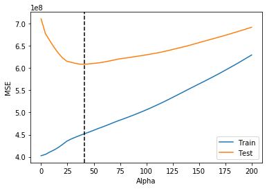

# Ridge and Lasso Regression - Lab

## Introduction

In this lab, you'll practice your knowledge of Ridge and Lasso regression!

## Objectives

In this lab you will: 

- Use Lasso and Ridge regression with scikit-learn 
- Compare and contrast Lasso, Ridge and non-regularized regression 

## Housing Prices Data

Let's look at yet another house pricing dataset: 


```python
import pandas as pd
import numpy as np
from sklearn.model_selection import train_test_split
import warnings
warnings.filterwarnings('ignore')

df = pd.read_csv('Housing_Prices/train.csv')
```

Look at `.info()` of the data: 


```python
# Your code here
df.info()
```

    <class 'pandas.core.frame.DataFrame'>
    RangeIndex: 1460 entries, 0 to 1459
    Data columns (total 81 columns):
     #   Column         Non-Null Count  Dtype  
    ---  ------         --------------  -----  
     0   Id             1460 non-null   int64  
     1   MSSubClass     1460 non-null   int64  
     2   MSZoning       1460 non-null   object 
     3   LotFrontage    1201 non-null   float64
     4   LotArea        1460 non-null   int64  
     5   Street         1460 non-null   object 
     6   Alley          91 non-null     object 
     7   LotShape       1460 non-null   object 
     8   LandContour    1460 non-null   object 
     9   Utilities      1460 non-null   object 
     10  LotConfig      1460 non-null   object 
     11  LandSlope      1460 non-null   object 
     12  Neighborhood   1460 non-null   object 
     13  Condition1     1460 non-null   object 
     14  Condition2     1460 non-null   object 
     15  BldgType       1460 non-null   object 
     16  HouseStyle     1460 non-null   object 
     17  OverallQual    1460 non-null   int64  
     18  OverallCond    1460 non-null   int64  
     19  YearBuilt      1460 non-null   int64  
     20  YearRemodAdd   1460 non-null   int64  
     21  RoofStyle      1460 non-null   object 
     22  RoofMatl       1460 non-null   object 
     23  Exterior1st    1460 non-null   object 
     24  Exterior2nd    1460 non-null   object 
     25  MasVnrType     1452 non-null   object 
     26  MasVnrArea     1452 non-null   float64
     27  ExterQual      1460 non-null   object 
     28  ExterCond      1460 non-null   object 
     29  Foundation     1460 non-null   object 
     30  BsmtQual       1423 non-null   object 
     31  BsmtCond       1423 non-null   object 
     32  BsmtExposure   1422 non-null   object 
     33  BsmtFinType1   1423 non-null   object 
     34  BsmtFinSF1     1460 non-null   int64  
     35  BsmtFinType2   1422 non-null   object 
     36  BsmtFinSF2     1460 non-null   int64  
     37  BsmtUnfSF      1460 non-null   int64  
     38  TotalBsmtSF    1460 non-null   int64  
     39  Heating        1460 non-null   object 
     40  HeatingQC      1460 non-null   object 
     41  CentralAir     1460 non-null   object 
     42  Electrical     1459 non-null   object 
     43  1stFlrSF       1460 non-null   int64  
     44  2ndFlrSF       1460 non-null   int64  
     45  LowQualFinSF   1460 non-null   int64  
     46  GrLivArea      1460 non-null   int64  
     47  BsmtFullBath   1460 non-null   int64  
     48  BsmtHalfBath   1460 non-null   int64  
     49  FullBath       1460 non-null   int64  
     50  HalfBath       1460 non-null   int64  
     51  BedroomAbvGr   1460 non-null   int64  
     52  KitchenAbvGr   1460 non-null   int64  
     53  KitchenQual    1460 non-null   object 
     54  TotRmsAbvGrd   1460 non-null   int64  
     55  Functional     1460 non-null   object 
     56  Fireplaces     1460 non-null   int64  
     57  FireplaceQu    770 non-null    object 
     58  GarageType     1379 non-null   object 
     59  GarageYrBlt    1379 non-null   float64
     60  GarageFinish   1379 non-null   object 
     61  GarageCars     1460 non-null   int64  
     62  GarageArea     1460 non-null   int64  
     63  GarageQual     1379 non-null   object 
     64  GarageCond     1379 non-null   object 
     65  PavedDrive     1460 non-null   object 
     66  WoodDeckSF     1460 non-null   int64  
     67  OpenPorchSF    1460 non-null   int64  
     68  EnclosedPorch  1460 non-null   int64  
     69  3SsnPorch      1460 non-null   int64  
     70  ScreenPorch    1460 non-null   int64  
     71  PoolArea       1460 non-null   int64  
     72  PoolQC         7 non-null      object 
     73  Fence          281 non-null    object 
     74  MiscFeature    54 non-null     object 
     75  MiscVal        1460 non-null   int64  
     76  MoSold         1460 non-null   int64  
     77  YrSold         1460 non-null   int64  
     78  SaleType       1460 non-null   object 
     79  SaleCondition  1460 non-null   object 
     80  SalePrice      1460 non-null   int64  
    dtypes: float64(3), int64(35), object(43)
    memory usage: 924.0+ KB


- First, split the data into `X` (predictor) and `y` (target) variables 
- Split the data into 75-25 training-test sets. Set the `random_state` to 10 
- Remove all columns of `object` type from `X_train` and `X_test` and assign them to `X_train_cont` and `X_test_cont`, respectively 


```python
from sklearn.metrics import mean_squared_error, mean_squared_log_error
from sklearn.linear_model import Lasso, Ridge, LinearRegression
from sklearn.impute import SimpleImputer
```


```python
# Create X and y
y = df['SalePrice']
X = df.drop(labels=['SalePrice', 'Id'], axis=1)

# Split data into training and test sets
X_train, X_test, y_train, y_test = train_test_split(X, y, test_size=0.25, random_state=10)

# Remove "object"-type features from X
cont_features = X.select_dtypes(exclude=['object'])

# Remove "object"-type features from X_train and X_test
X_train_cont = X_train.select_dtypes(exclude=['object'])
X_test_cont = X_test.select_dtypes(exclude=['object'])
```


```python
X_train_cont.info()
```

    <class 'pandas.core.frame.DataFrame'>
    Int64Index: 1095 entries, 567 to 1289
    Data columns (total 36 columns):
     #   Column         Non-Null Count  Dtype  
    ---  ------         --------------  -----  
     0   MSSubClass     1095 non-null   int64  
     1   LotFrontage    904 non-null    float64
     2   LotArea        1095 non-null   int64  
     3   OverallQual    1095 non-null   int64  
     4   OverallCond    1095 non-null   int64  
     5   YearBuilt      1095 non-null   int64  
     6   YearRemodAdd   1095 non-null   int64  
     7   MasVnrArea     1090 non-null   float64
     8   BsmtFinSF1     1095 non-null   int64  
     9   BsmtFinSF2     1095 non-null   int64  
     10  BsmtUnfSF      1095 non-null   int64  
     11  TotalBsmtSF    1095 non-null   int64  
     12  1stFlrSF       1095 non-null   int64  
     13  2ndFlrSF       1095 non-null   int64  
     14  LowQualFinSF   1095 non-null   int64  
     15  GrLivArea      1095 non-null   int64  
     16  BsmtFullBath   1095 non-null   int64  
     17  BsmtHalfBath   1095 non-null   int64  
     18  FullBath       1095 non-null   int64  
     19  HalfBath       1095 non-null   int64  
     20  BedroomAbvGr   1095 non-null   int64  
     21  KitchenAbvGr   1095 non-null   int64  
     22  TotRmsAbvGrd   1095 non-null   int64  
     23  Fireplaces     1095 non-null   int64  
     24  GarageYrBlt    1037 non-null   float64
     25  GarageCars     1095 non-null   int64  
     26  GarageArea     1095 non-null   int64  
     27  WoodDeckSF     1095 non-null   int64  
     28  OpenPorchSF    1095 non-null   int64  
     29  EnclosedPorch  1095 non-null   int64  
     30  3SsnPorch      1095 non-null   int64  
     31  ScreenPorch    1095 non-null   int64  
     32  PoolArea       1095 non-null   int64  
     33  MiscVal        1095 non-null   int64  
     34  MoSold         1095 non-null   int64  
     35  YrSold         1095 non-null   int64  
    dtypes: float64(3), int64(33)
    memory usage: 316.5 KB


## Let's use this data to build a first naive linear regression model

- Fill the missing values in data using median of the columns (use [`SimpleImputer`](https://scikit-learn.org/stable/modules/generated/sklearn.impute.SimpleImputer.html)) 
- Fit a linear regression model to this data 
- Compute the R-squared and the MSE for both the training and test sets 


```python
# Impute missing values with median using SimpleImputer
impute = SimpleImputer(missing_values=np.nan, strategy='median')
X_train_imputed = impute.fit(cont_features).transform(X_train_cont)
X_test_imputed = impute.fit(cont_features).transform(X_test_cont)

# Fit the model and print R2 and MSE for training and test sets
linreg = LinearRegression()
linreg.fit(X_train_imputed, y_train)

# Print R2 and MSE for training and test sets
y_predict_train = linreg.predict(X_train_imputed)
y_predict_test = linreg.predict(X_test_imputed)
```


```python
rss_train = sum((y_train - y_predict_train ) ** 2 ) 
rss_test = sum((y_test - y_predict_test) ** 2)
mse_train = sum((y_train - y_predict_train ) ** 2 ) / len(y_train)
mse_test = sum((y_test - y_predict_test) ** 2) / len(y_test)
print("RSS Train: {}".format(rss_train))
print("MSE Train: {}".format(mse_train))
print("RSS Test: {}".format(rss_test))
print("MSE Test: {}".format(mse_test))

print('Training r^2:', round(linreg.score(X_train_imputed, y_train), 4))
print('Test r^2:', round(linreg.score(X_test_imputed, y_test), 4))
print('Training MSE:', round(mean_squared_error(y_train, linreg.predict(X_train_imputed)), 4))
print('Test MSE:', round(mean_squared_error(y_test, linreg.predict(X_test_imputed)), 4))
```

    RSS Train: 1327726784385.3599
    MSE Train: 1212535876.1510136
    RSS Test: 418209358379.76605
    MSE Test: 1145779064.0541537
    Training r^2: 0.807
    Test r^2: 0.8204
    Training MSE: 1212535876.151
    Test MSE: 1145779064.0542


## Normalize your data

- Normalize your data using a `StandardScalar`  
- Fit a linear regression model to this data 
- Compute the R-squared and the MSE for both the training and test sets 


```python
from sklearn.preprocessing import StandardScaler

# Scale the train and test data
ss = StandardScaler()
X_train_imputed_scaled = ss.fit_transform(X_train_imputed)
X_test_imputed_scaled = ss.transform(X_test_imputed)

# Fit the model
linreg_norm = linreg.fit(X_train_imputed_scaled, y_train)


# Print R2 and MSE for training and test sets
print("R2 Training: {}".format(linreg_norm.score(X_train_imputed_scaled, y_train)))
print("R2 Test: {}".format(linreg_norm.score(X_test_imputed_scaled, y_test)))
```

    R2 Training: 0.806948609877586
    R2 Test: 0.8203157666995754


## Include categorical variables

The above models didn't include categorical variables so far, let's include them! 


- Include all columns of `object` type from `X_train` and `X_test` and assign them to `X_train_cat` and `X_test_cat`, respectively 
- Fill missing values in all these columns with the string `'missing'` 


```python
# Create X_cat which contains only the categorical variables
features_cat = X.select_dtypes(include=['object'])
X_train_cat = X_train.select_dtypes(include=['object'])
X_test_cat = X_test.select_dtypes(include=['object'])

# Fill missing values with the string 'missing'
features_cat.fillna(value='missing', inplace=True)
X_train_cat.fillna(value='missing', inplace=True)
X_test_cat.fillna(value='missing', inplace=True)
```

- One-hot encode all these categorical columns using `OneHotEncoder` 
- Transform the training and test DataFrames (`X_train_cat`) and (`X_test_cat`) 
- Run the given code to convert these transformed features into DataFrames 


```python
from sklearn.preprocessing import OneHotEncoder

# OneHotEncode categorical variables
ohe = OneHotEncoder(handle_unknown='ignore').fit(X_train_cat)
```


```python
# Transform training and test sets
X_train_ohe = ohe.transform(X_train_cat)
X_test_ohe = ohe.transform(X_test_cat)

# Convert these columns into a DataFrame
columns = ohe.get_feature_names(input_features=X_train_cat.columns)
cat_train_df = pd.DataFrame(X_train_ohe.todense(), columns=columns)
cat_test_df = pd.DataFrame(X_test_ohe.todense(), columns=columns)
```


```python
cont_columns = X_train_cont.columns
X_train_imputed_scaled_df = pd.DataFrame(X_train_imputed_scaled, columns=cont_columns)
X_test_imputed_scaled_df =  pd.DataFrame(X_test_imputed_scaled, columns=cont_columns)
```

- Combine `X_train_imputed_scaled` and `cat_train_df` into a single DataFrame  
- Similarly, combine `X_test_imputed_scaled` and `cat_test_df` into a single DataFrame 


```python
# Your code here
X_train_all = pd.concat([X_train_imputed_scaled_df, cat_train_df], axis=1)
X_test_all = pd.concat([X_test_imputed_scaled_df, cat_test_df], axis=1)
```


```python
X_train_all.head()
```


<div>
<style scoped>
    .dataframe tbody tr th:only-of-type {
        vertical-align: middle;
    }

    .dataframe tbody tr th {
        vertical-align: top;
    }

    .dataframe thead th {
        text-align: right;
    }
</style>
<table border="1" class="dataframe">
  <thead>
    <tr style="text-align: right;">
      <th></th>
      <th>MSSubClass</th>
      <th>LotFrontage</th>
      <th>LotArea</th>
      <th>OverallQual</th>
      <th>OverallCond</th>
      <th>YearBuilt</th>
      <th>YearRemodAdd</th>
      <th>MasVnrArea</th>
      <th>BsmtFinSF1</th>
      <th>BsmtFinSF2</th>
      <th>...</th>
      <th>SaleType_ConLw</th>
      <th>SaleType_New</th>
      <th>SaleType_Oth</th>
      <th>SaleType_WD</th>
      <th>SaleCondition_Abnorml</th>
      <th>SaleCondition_AdjLand</th>
      <th>SaleCondition_Alloca</th>
      <th>SaleCondition_Family</th>
      <th>SaleCondition_Normal</th>
      <th>SaleCondition_Partial</th>
    </tr>
  </thead>
  <tbody>
    <tr>
      <th>0</th>
      <td>-0.868555</td>
      <td>-0.013208</td>
      <td>-0.045149</td>
      <td>0.639596</td>
      <td>-0.525371</td>
      <td>1.075842</td>
      <td>0.927822</td>
      <td>0.344734</td>
      <td>-0.954564</td>
      <td>-0.280761</td>
      <td>...</td>
      <td>0.0</td>
      <td>0.0</td>
      <td>0.0</td>
      <td>1.0</td>
      <td>0.0</td>
      <td>0.0</td>
      <td>0.0</td>
      <td>0.0</td>
      <td>1.0</td>
      <td>0.0</td>
    </tr>
    <tr>
      <th>1</th>
      <td>3.097630</td>
      <td>-0.447533</td>
      <td>0.061269</td>
      <td>-1.551303</td>
      <td>0.386327</td>
      <td>-2.868883</td>
      <td>-1.700933</td>
      <td>-0.570404</td>
      <td>-0.958883</td>
      <td>-0.280761</td>
      <td>...</td>
      <td>0.0</td>
      <td>0.0</td>
      <td>0.0</td>
      <td>1.0</td>
      <td>0.0</td>
      <td>0.0</td>
      <td>0.0</td>
      <td>0.0</td>
      <td>1.0</td>
      <td>0.0</td>
    </tr>
    <tr>
      <th>2</th>
      <td>0.064665</td>
      <td>0.203954</td>
      <td>-0.083475</td>
      <td>0.639596</td>
      <td>0.386327</td>
      <td>0.876949</td>
      <td>0.635738</td>
      <td>-0.570404</td>
      <td>1.146352</td>
      <td>-0.280761</td>
      <td>...</td>
      <td>0.0</td>
      <td>0.0</td>
      <td>0.0</td>
      <td>1.0</td>
      <td>0.0</td>
      <td>0.0</td>
      <td>0.0</td>
      <td>0.0</td>
      <td>1.0</td>
      <td>0.0</td>
    </tr>
    <tr>
      <th>3</th>
      <td>2.397715</td>
      <td>-1.142454</td>
      <td>-0.488028</td>
      <td>0.639596</td>
      <td>1.298025</td>
      <td>0.512310</td>
      <td>0.100251</td>
      <td>-0.570404</td>
      <td>0.109929</td>
      <td>1.130417</td>
      <td>...</td>
      <td>0.0</td>
      <td>0.0</td>
      <td>0.0</td>
      <td>1.0</td>
      <td>0.0</td>
      <td>0.0</td>
      <td>0.0</td>
      <td>0.0</td>
      <td>1.0</td>
      <td>0.0</td>
    </tr>
    <tr>
      <th>4</th>
      <td>-0.868555</td>
      <td>0.334252</td>
      <td>-0.047972</td>
      <td>-0.090704</td>
      <td>0.386327</td>
      <td>0.081374</td>
      <td>0.684419</td>
      <td>-0.031126</td>
      <td>0.472677</td>
      <td>2.193723</td>
      <td>...</td>
      <td>0.0</td>
      <td>0.0</td>
      <td>0.0</td>
      <td>1.0</td>
      <td>0.0</td>
      <td>0.0</td>
      <td>0.0</td>
      <td>0.0</td>
      <td>1.0</td>
      <td>0.0</td>
    </tr>
  </tbody>
</table>
<p>5 rows × 295 columns</p>
</div>


Now build a linear regression model using all the features (`X_train_all`). Also, print the R-squared and the MSE for both the training and test sets. 


```python
# Your code here
linear = LinearRegression()
linear.fit(X_train_all, y_train)
print("R2 Training: {}".format(linear.score(X_train_all, y_train)))
print("R2 Test: {}".format(linear.score(X_test_all, y_test)))
print('Training MSE:', round(mean_squared_error(y_train, linear.predict(X_train_all)), 4))
print('Test MSE:', round(mean_squared_error(y_test, linear.predict(X_test_all)), 4))
```

    R2 Training: 0.9358962119695141
    R2 Test: -2.305003164946374e+18
    Training MSE: 402637146.3479
    Test MSE: 1.4706346870029044e+28


```python
X_train_all.shape, y_train.shape
```


    ((1095, 295), (1095,))


Notice the severe overfitting above; our training R-squared is very high, but the test R-squared is negative! Similarly, the scale of the test MSE is orders of magnitude higher than that of the training MSE.

## Ridge and Lasso regression

Use all the data (normalized features and dummy categorical variables, `X_train_all`) to build two models - one each for Lasso and Ridge regression. Each time, look at R-squared and MSE. 

## Lasso

#### With default parameter (alpha = 1)


```python
# Your code here
lasso_1 = Lasso(alpha=1)
lasso_1.fit(X_train_all, y_train)
```


    Lasso(alpha=1, copy_X=True, fit_intercept=True, max_iter=1000, normalize=False,
          positive=False, precompute=False, random_state=None, selection='cyclic',
          tol=0.0001, warm_start=False)


#### With a higher regularization parameter (alpha = 10)


```python
# Your code here
lasso_10 = Lasso(alpha=10)
lasso_10.fit(X_train_all, y_train)
```


    Lasso(alpha=10, copy_X=True, fit_intercept=True, max_iter=1000, normalize=False,
          positive=False, precompute=False, random_state=None, selection='cyclic',
          tol=0.0001, warm_start=False)


## Ridge

#### With default parameter (alpha = 1)


```python
# Your code here
ridge_1 = Ridge(alpha=11)
ridge_1.fit(X_train_all, y_train)
```


    Ridge(alpha=11, copy_X=True, fit_intercept=True, max_iter=None, normalize=False,
          random_state=None, solver='auto', tol=0.001)


#### With default parameter (alpha = 10)


```python
# Your code here
ridge_10 = Ridge(alpha=10)
ridge_10.fit(X_train_all, y_train)
```


    Ridge(alpha=10, copy_X=True, fit_intercept=True, max_iter=None, normalize=False,
          random_state=None, solver='auto', tol=0.001)


## Compare the metrics    

Write your conclusions here: 
_________________________________


## Compare number of parameter estimates that are (very close to) 0 for Ridge and Lasso

Use 10**(-10) as an estimate that is very close to 0. 


```python
# Number of Ridge params almost zero
len([x for x in ridge_1.coef_ if abs(x) < 10**(-10)])
```


    0


```python
len([x for x in ridge_10.coef_ if abs(x) < 10**(-10)])
```


    0


```python
# Number of Lasso params almost zero
len([x for x in lasso_1.coef_ if abs(x) < 10**(-10)])
```


    37


```python
len([x for x in lasso_10.coef_ if abs(x) < 10**(-10)])
```


    79


```python
print(len(lasso_1.coef_))
print(sum(abs(lasso_1.coef_) < 10**(-10))/ len(lasso_1.coef_))
```

    295
    0.12542372881355932


```python
print(len(lasso_10.coef_))
print(sum(abs(lasso_10.coef_) < 10**(-10))/ len(lasso_10.coef_))
```

    295
    0.2677966101694915


Lasso was very effective to essentially perform variable selection and remove about 25% of the variables from your model!

## Put it all together

To bring all of our work together lets take a moment to put all of our preprocessing steps for categorical and continuous variables into one function. This function should take in our features as a dataframe `X` and target as a Series `y` and return a training and test DataFrames with all of our preprocessed features along with training and test targets. 


```python
def preprocess(X, y):
    '''Takes in features and target and implements all preprocessing steps for categorical and
    continuous features returning 
    train and test DataFrames with targets'''
    
    # Train-test split (75-25), set seed to 10
    X_train, X_test, y_train, y_test = train_test_split(X, y, test_size=0.25, random_state=10)

    # Remove "object"-type features from X
    cont_features = X.select_dtypes(exclude=['object'])

    # Remove "object"-type features from X_train and X_test
    X_train_cont = X_train.select_dtypes(exclude=['object'])
    X_test_cont = X_test.select_dtypes(exclude=['object'])
    

    # Impute missing values with median using SimpleImputer
    impute = SimpleImputer(missing_values=np.nan, strategy='median')
    X_train_imputed = impute.fit(cont_features).transform(X_train_cont)
    X_test_imputed = impute.fit(cont_features).transform(X_test_cont)

    # Scale the train and test data
    ss = StandardScaler()
    X_train_imputed_scaled = ss.fit_transform(X_train_imputed)
    X_test_imputed_scaled = ss.transform(X_test_imputed)

    # Create X_cat which contains only the categorical variables
    features_cat = X.select_dtypes(include=['object'])
    X_train_cat = X_train.select_dtypes(include=['object'])
    X_test_cat = X_test.select_dtypes(include=['object'])
    
    # Fill nans with a value indicating that that it is missing
    features_cat.fillna(value='missing', inplace=True)
    X_train_cat.fillna(value='missing', inplace=True)
    X_test_cat.fillna(value='missing', inplace=True)

    # OneHotEncode Categorical variables
    ohe = OneHotEncoder(handle_unknown='ignore').fit(X_train_cat)
    # Convert these columns into a DataFrame
    columns = ohe.get_feature_names(input_features=X_train_cat.columns)
    cat_train_df = pd.DataFrame(X_train_ohe.todense(), columns=columns)
    cat_test_df = pd.DataFrame(X_test_ohe.todense(), columns=columns)
    

    # Combine categorical and continuous features into the final dataframe
    cont_columns = X_train_cont.columns
    X_train_imputed_scaled_df = pd.DataFrame(X_train_imputed_scaled, columns=cont_columns)
    X_test_imputed_scaled_df =  pd.DataFrame(X_test_imputed_scaled, columns=cont_columns)
    X_train_all = pd.concat([X_train_imputed_scaled_df, cat_train_df], axis=1)
    X_test_all = pd.concat([X_test_imputed_scaled_df, cat_test_df], axis=1)
    
    return X_train_all, X_test_all, y_train, y_test
```

### Graph the training and test error to find optimal alpha values

Earlier we tested two values of alpha to see how it effected our MSE and the value of our coefficients. We could continue to guess values of alpha for our Ridge or Lasso regression one at a time to see which values minimize our loss, or we can test a range of values and pick the alpha which minimizes our MSE. Here is an example of how we would do this:  


```python
X_train_all, X_test_all, y_train, y_test = preprocess(X, y)

train_mse = []
test_mse = []
alphas = []

for alpha in np.linspace(0, 200, num=50):
    lasso = Lasso(alpha=alpha)
    lasso.fit(X_train_all, y_train)
    
    train_preds = lasso.predict(X_train_all)
    train_mse.append(mean_squared_error(y_train, train_preds))
    
    test_preds = lasso.predict(X_test_all)
    test_mse.append(mean_squared_error(y_test, test_preds))
    
    alphas.append(alpha)
```


```python
import matplotlib.pyplot as plt
%matplotlib inline

fig, ax = plt.subplots()
ax.plot(alphas, train_mse, label='Train')
ax.plot(alphas, test_mse, label='Test')
ax.set_xlabel('Alpha')
ax.set_ylabel('MSE')

# np.argmin() returns the index of the minimum value in a list
optimal_alpha = alphas[np.argmin(test_mse)]

# Add a vertical line where the test MSE is minimized
ax.axvline(optimal_alpha, color='black', linestyle='--')
ax.legend();

print(f'Optimal Alpha Value: {int(optimal_alpha)}')
```

    Optimal Alpha Value: 40





Take a look at this graph of our training and test MSE against alpha. Try to explain to yourself why the shapes of the training and test curves are this way. Make sure to think about what alpha represents and how it relates to overfitting vs underfitting.

## Summary

Well done! You now know how to build Lasso and Ridge regression models, use them for feature selection and find an optimal value for $\text{alpha}$. 
